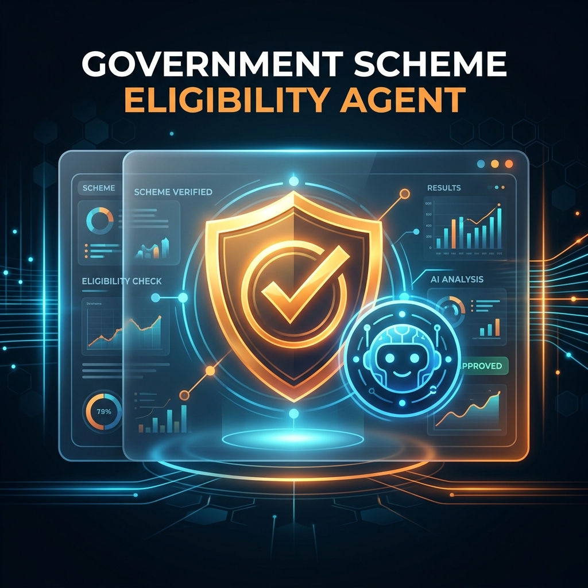

# Government Scheme Eligibility Agent - Portal

<p align="center">
  
</p>

A modern, responsive, and highly accessible frontend application designed to simplify government scheme discovery, eligibility verification, document validation, and NGO connectivity.

---

## 🌟 Key Features

### 1. Citizen Dashboard
- **Scheme Search & Filtering:** Browse, search, and filter through 100+ national and state schemes by category and location.
- **AI Eligibility Evaluation:** Instantly evaluate scheme eligibility based on your demographic profile (age, state, income, education, occupation).
- **Life Event Predictions:** Predict potential future life milestones and suggest matching schemes.
- **Analytics & Statistics:** Real-time visual insights showing scheme distribution, category splits, and application statuses.

### 2. WhatsApp-Style AI Agent Chat
- Chat with **NIC Welfare Coordinator** and specialized assistants (Scholarship Specialist, Health & Pension Advisor, NGO Support Officer) in an intuitive messaging interface.
- Rich interactive cards (chips) for quick replies.
- Built-in speech-to-text (voice recognition) for hands-free queries.

### 3. Document Vault & Verification
- Upload key documents (e.g., Aadhaar Card, Income Certificate).
- Automated validation checking that uploaded documents match eligibility criteria.

### 4. NGO Portal & Directory
- **Directory Search:** Discover registered NGOs by state, district, or services offered (healthcare, education, women support, etc.).
- **Assistance Requests:** Submit help requests directly to local NGOs with relevant uploaded documents.
- **NGO Dashboard:** Dedicated workspace for NGO representatives to view, track, and update incoming request statuses with remarks.

### 5. Admin Panel
- CRUD operations to manage registered NGOs.
- Dashboard analytics showing total NGO coverage and service breakdown.

### 6. Accessibility & Inclusivity (A11y)
- **Voice Guidance:** Auto-narrates key actions and status changes.
- **Multi-language support:** Seamless English/Hindi localization.
- **Display Modes:** High-contrast theme, dark mode, and font size scaling.
- **Fraud Scanner:** Identify and flag potential scam links or fraudulent scheme websites.

---

## 🚀 Tech Stack

- **Framework:** React + Vite
- **Styling:** TailwindCSS + Custom CSS
- **Icons:** Lucide React
- **Hosting / Dev Server:** Node.js (Vite dev server)

---

## 🛠️ Getting Started

### Prerequisites
Make sure you have Node.js installed.

### Installation
1. Install dependencies:
   ```bash
   npm install
   ```

2. Run the development server:
   ```bash
   npm run dev
   ```

3. Build for production:
   ```bash
   npm run build
   ```
