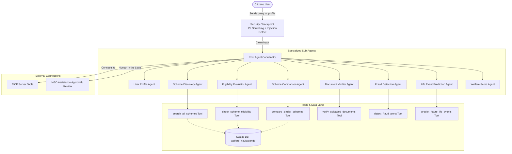
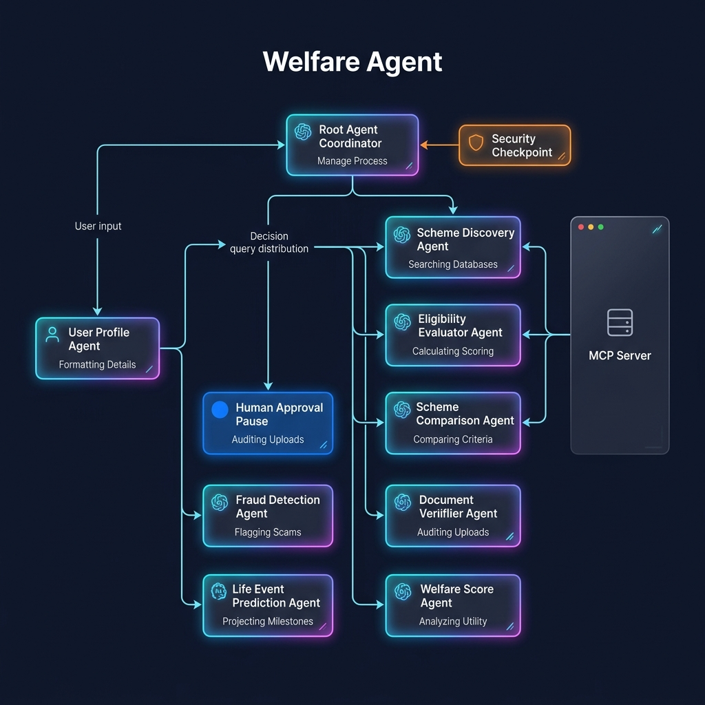

# Welfare Agent

An AI-powered Government Welfare Operating System built on the Agent Development Kit (ADK) that simplifies scheme discovery, eligibility evaluation, document verification, and fraud detection for citizens.

## Prerequisites

- Python 3.11+
- **uv** (Python package and dependency manager)
- **Gemini API Key**: Create one at [Google AI Studio API Keys](https://aistudio.google.com/apikey)

## Quick Start

```bash
git clone <repo-url>
cd welfare-agent
cp .env.example .env   # add your GOOGLE_API_KEY
make install
make playground        # opens UI at http://localhost:18081
```

## Architecture

Below is the conceptual architecture showing the workflow of the Welfare Agent system:



## How to Run

- **Interactive Playground (UI Testing):**
  ```bash
  make playground
  ```
  Runs the local agent development playground at `http://localhost:18081`.

- **Local Web Server (FastAPI Mode):**
  ```bash
  make run
  ```
  Launches the FastAPI backend server on `http://localhost:8000` (which serves the React frontend).

## Sample Test Cases

### Test Case 1: Scheme Search & Discovery
- **Input:**
  ```json
  {
    "message": "Find scholarships available for B.Tech students."
  }
  ```
- **Expected Behavior:** The `root_coordinator` routes the query to `scheme_discovery_agent`. The agent calls `search_all_schemes` and queries the SQLite database for records matching "B.Tech" or "scholarship", returning schemes like the *Central Sector Scheme of Scholarship*.
- **Check:** In the playground UI or terminal logs, you will see `scheme_discovery_agent` active, the tool call trace for `search_all_schemes`, and a markdown list detailing scholarship benefits and eligibility.

### Test Case 2: Multi-Criteria Eligibility Evaluation
- **Input:**
  ```json
  {
    "message": "Am I eligible for the PM Vidya Scheme? My profile: Age 20, General category, from Delhi, annual family income is 1.5 Lakhs, occupation is student."
  }
  ```
- **Expected Behavior:** The `root_coordinator` forwards the context to `eligibility_evaluator_agent`. It triggers the `check_scheme_eligibility` tool to compute criteria scoring (domicile, income, age, category).
- **Check:** The UI displays an Eligibility Score (e.g. 92%), a checklist showing passed checks (✓ Domicile, ✓ Income, ✓ Age) and a clear qualification decision.

### Test Case 3: Phishing / Fraud Scan
- **Input:**
  ```json
  {
    "message": "Check if this link is safe: http://pm-scholarship-free-laptop.com"
  }
  ```
- **Expected Behavior:** The `root_coordinator` targets `fraud_detection_agent`. The agent calls `detect_fraud_alerts` to inspect the domain. It flags that the URL does not end in `.gov.in` or `.nic.in` and raises a `Dangerous` safety rating warning.
- **Check:** The playground output prints a red banner with "HIGH ALERT: Fake Portal Detected" and points the user to the official portal `myscheme.gov.in`.

## Troubleshooting

1. **Error: `ModuleNotFoundError: No module named 'app'`**
   - *Cause:* Running python directly without setting Python path or without using the proper `uv` runner.
   - *Fix:* Ensure you launch using `make run` or run with `uv run python -m app.fast_api_app`.

2. **Error: `Gemini API 404 Model Not Found`**
   - *Cause:* Using deprecated/retired model strings (e.g. `gemini-1.5-*`).
   - *Fix:* Check your model configuration in `app/agent.py` and verify it uses `gemini-2.5-flash` or `gemini-flash-latest`.

3. **Error: `sqlite3.OperationalError: no such table: schemes`**
   - *Cause:* The SQLite database file path is resolved incorrectly relative to the execution directory.
   - *Fix:* Verify that the database proxy resolves the absolute path correctly (handled automatically by `tools.py` using `os.path.dirname(os.path.abspath(__file__))`).

## Push to GitHub

1. Create a new repo at https://github.com/new
   - Name: welfare-agent
   - Visibility: Public or Private
   - Do NOT initialize with README (you already have one)

2. In your terminal, navigate into your project folder:
   cd welfare-agent
   git init
   git add .
   git commit -m "Initial commit: welfare-agent ADK agent"
   git branch -M main
   git remote add origin https://github.com/<your-username>/welfare-agent.git
   git push -u origin main

3. Verify .gitignore includes:
   .env          ← your API key — must NEVER be pushed
   .venv/
   __pycache__/
   *.pyc
   .adk/

⚠ NEVER push .env to GitHub. Your API key will be exposed publicly.

## Assets

### Project Cover Banner


### Agent Workflow Diagram


## Demo Script

A spoken walkthrough script for demonstrating the project can be found in [DEMO_SCRIPT.txt](file:///c:/Users/shiva/OneDrive/Desktop/capstone%20project/goverment%20scheme/welfare-agent/DEMO_SCRIPT.txt).

