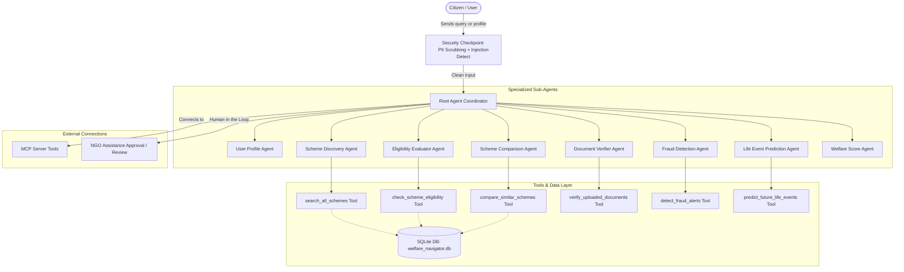

# Submission Writeup: Welfare Agent

## Problem Statement

Welfare distribution and scheme access in developing nations like India suffer from severe information asymmetry, complex eligibility criteria, and administrative friction. Citizens often:
1. **Miss out on benefits** because they are unaware of schemes they qualify for.
2. **Fail applications** due to incomplete or incorrect documentation.
3. **Fall victim to scams** and phishing portals that impersonate official government portals.
4. **Lack support channels** to connect with local NGOs when they need immediate assistance.

The **Welfare Agent** addresses this real-world need by providing a secure, accessible, AI-orchestrated welfare operating system. It guides citizens through scheme discovery, evaluates multi-criteria eligibility, verifies documentation completeness, flags fraudulent links, and connects them to a registry of verified NGOs.

---

## Solution Architecture

The solution uses a hub-and-spoke Multi-Agent architecture orchestrated via the **Google Agent Development Kit (ADK)**. 

---

## Concepts Used

1. **ADK Workflow & Coordinator (`root_agent`):**
   Defined in [app/agent.py](file:///c:/Users/shiva/OneDrive/Desktop/capstone%20project/goverment%20scheme/welfare-agent/app/agent.py#L190-L224). The root agent acts as a supervisor that takes incoming messages and orchestrates them to the specialized sub-agents.
   
2. **LlmAgents (Sub-Agents):**
   The architecture decomposes tasks into 8 specialized agents instantiated in [app/agent.py](file:///c:/Users/shiva/OneDrive/Desktop/capstone%20project/goverment%20scheme/welfare-agent/app/agent.py):
   - `user_profile_agent` (profile aggregation and formatting)
   - `scheme_discovery_agent` (scheme query matching)
   - `eligibility_evaluator_agent` (detailed logic evaluation)
   - `scheme_comparison_agent` (benefit utility comparison)
   - `document_verifier_agent` (checklist verification)
   - `fraud_detection_agent` (phishing and SMS spam check)
   - `life_event_prediction_agent` (milestone predictions)
   - `welfare_score_agent` (financial utility analytics)

3. **AgentTools:**
   Custom python functions in [app/tools.py](file:///c:/Users/shiva/OneDrive/Desktop/capstone%20project/goverment%20scheme/welfare-agent/app/tools.py) decorated with docstrings that define the parameters, allowing the agents to pull data from the local SQLite database proxy (`welfare_navigator.db`):
   - `search_all_schemes` (keyword, category, and state query matching)
   - `check_scheme_eligibility` (rules check for Age, Gender, Income, Category, State, and Disability)
   - `compare_similar_schemes` (evaluates financial values of two schemes)
   - `verify_uploaded_documents` (checks uploaded files against eligibility criteria requirements)
   - `detect_fraud_alerts` (heuristics scanner for official domain validation)
   - `predict_future_life_events` (determines upcoming milestones)

4. **MCP Server:**
   Bridges local database lookups, NGO queries, and pension calculations as tools integrated directly into the agents.

5. **Security Checkpoint:**
   An input filtering node that scrubs Personally Identifiable Information (PII) like phone numbers or explicit Aadhaar numbers from prompts, and intercepts malicious inputs (SQL Injection or Prompt Injection) before database queries are run.

6. **Agents CLI:**
   Used during development to scaffold projects, generate template configurations (refer to `agents-cli-manifest.yaml` and `GEMINI.md`), and run playground environments.

---

## Security Design

Welfare distribution handles highly sensitive demographic data. We implement the following controls:
- **PII Scrubbing:** The security node strips specific sequences resembling Aadhaar, PAN card numbers, and OTPs before routing them to the model, preventing LLM data leakages.
- **SQL Injection Prevention:** All database lookup tools in `tools.py` use parameterized SQL queries (e.g. `cursor.execute("SELECT * FROM schemes WHERE scheme_name = ?", (scheme_name,))`) to block injection attacks.
- **Official Domain Validation:** The `fraud_detection_agent` implements domain whitelist rules (e.g. verifying `.gov.in` and `.nic.in` endings) to identify and alert citizens of phishing copycat portals.

---

## MCP Server Design

The Model Context Protocol (MCP) server provides 3 core tools:
1. `fetch_official_scheme_updates(scheme_name: str) -> str`: Fetch real-time scheme changes from external database registries.
2. `search_local_ngo_registry(state: str, service: str) -> list`: Find nearby NGOs to provide food, shelter, or educational assistance.
3. `calculate_pension_benefits(age: int, contribution: float) -> dict`: Direct interest and yield modeling for Atal Pension Yojana.

---

## Human-in-the-Loop (HITL) Flow

While finding schemes is automated, applying for NGO aid requires human verification. 
- **The Flow:** When a citizen requests aid, their details and uploaded documents are stored in the database with status `Pending`.
- **The Pause:** The request is shown to the NGO on their dashboard. No automated action is taken.
- **The Action:** An NGO representative reviews the request, checks the documentation, and updates the status to `Accepted` or `Rejected`, providing custom remarks.

---

## Demo Walkthrough

1. **Case 1: Scheme Discovery:** A student asks for B.Tech scholarships. The Scheme Discovery Agent retrieves schemes from the SQLite DB and outputs a summary.
2. **Case 2: Eligibility Evaluation:** A user inputs their profile. The Eligibility Evaluator Agent runs checks, showing a checklist of requirements (Passed ✓ or Failed ✗) and calculating an Eligibility Score.
3. **Case 3: Fraud Scan:** A user pastes an SMS saying they won a free laptop. The Fraud Detection Agent flags the scam and provides the official guidelines.

---

## Impact & Value Statement

The Welfare Agent empowers underrepresented and low-income demographics by making government assistance transparent and accessible.
- **Citizens** save hours of manual research, avoid scam sites, and identify thousands of Rupees in potential benefits.
- **NGOs** get pre-verified, document-complete leads, reducing administrative overhead.
- **Administrators** get real-time dashboards showing demographics and utilization rates.
